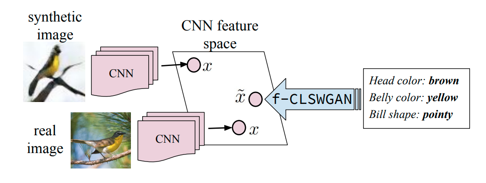
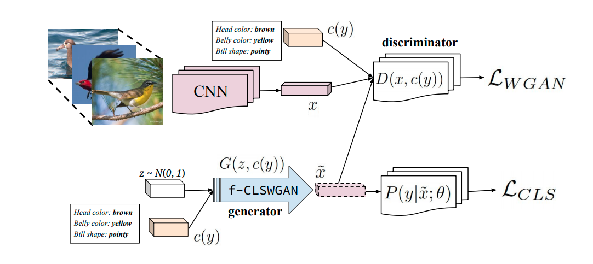

# Feature Generating Networks for Zero-Shot Learning
The unofficial implementation of [Feature Generating Networks for Zero-Shot Learning](https://arxiv.org/abs/1712.00981) on Pytorch

*Figure from Official Paper*

## Generalized Zero Shot Learning (GZSL)
- Zero-shot learning aims to recognize objects whose instances may not have been seen during training. [1]
- GZSL leverages semantic information of both seen (source) and unseen (target) classes to bridge the gap between both seen and unseen classes [2]

## Model Architecture

*f-CLSWGAN Architecture Figure from Official Paper*

## Dependencies
- Python 3.6+
- `pip install -r requirements.txt`

## Dataset
- Animal with Attributes 2 [3] dataset is used. This dataset contains 50 classes with 37322 images. 40 classes are divided to seen classes.
- Original paper authors has shared the features maps from ResNet101 [4]. These feature maps are used to train networks.
- Seen classes are splitted to train and test sets. `trainval_loc` indexes ares used for training, `test_seen_loc` indexes are used for testing.[4]
- Unseen classes are not splitted. `test_unseen_loc` indexes are used for both trainin and testing. [4]

## Training
- After running scripts for training, models will be saved to defined path in `config.py`.
- This command will start to training process without any pretrained models.
    - `python main.py --train`
- Pretrained models for any part of proposed approach can be used for fine-tuning. 
    - `python main.py --train --g_cls_path <path/to/model>`
    - `python main.py --train --g_cls_path <path/to/model> --wgan_G_path <path/to/model> --wgan_D_path <path/to/model> --projection_path <path/to/model>`

## Evaluation
- Pretrained models can be used for evaluation 
    - `python main.py --g_cls_path <path/to/model> --wgan_G_path <path/to/model> --wgan_D_path <path/to/model> --projection_path <path/to/model>`

## References
- [1] [Zero-Shot Learning - A Comprehensive Evaluation of the Good, the Bad and the Ugly](https://arxiv.org/pdf/1707.00600.pdf)
- [2] [A Review of Generalized Zero-Shot Learning Methods](https://arxiv.org/pdf/2011.08641.pdf)
- [3] [Animal with Attributes 2](https://cvml.ist.ac.at/AwA2/)
- [4] [ResNet101 Feature Maps of AWA2 Dataset](https://datasets.d2.mpi-inf.mpg.de/xian/xlsa17.zip)